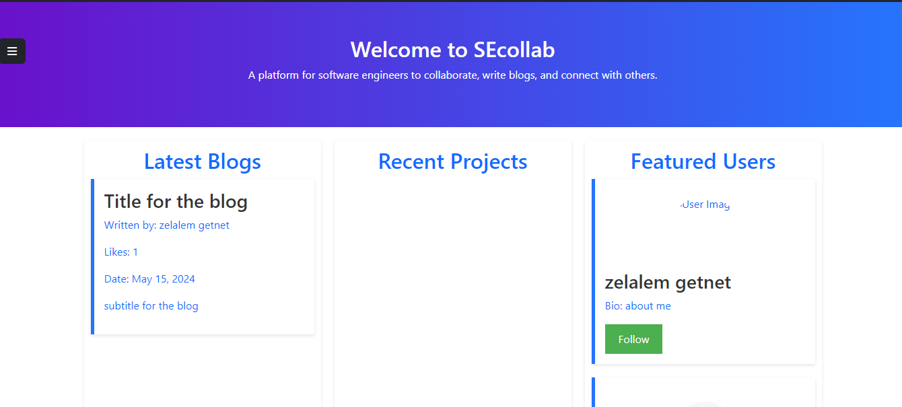
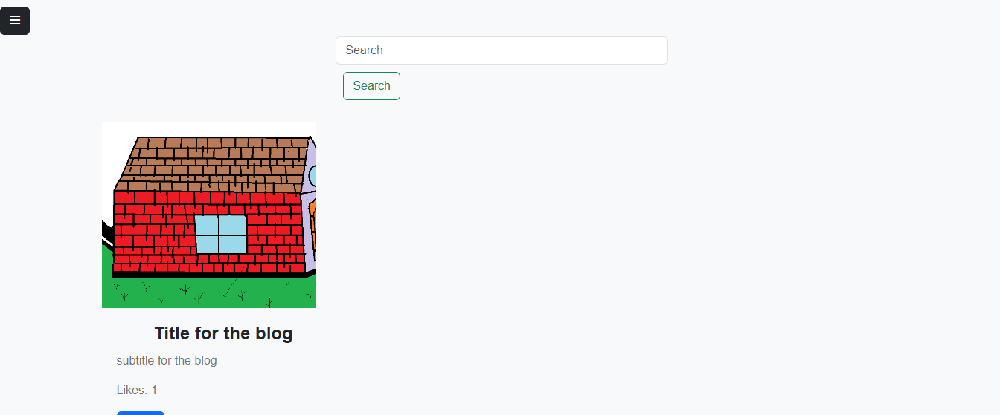
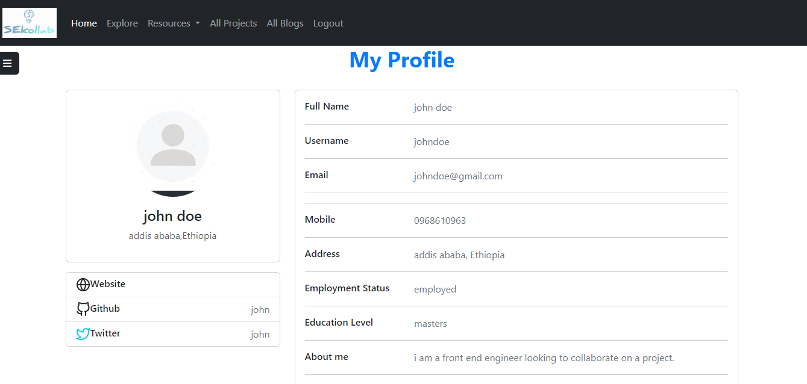

SEcollab 

Introduction 

SEcollab is a web application that connects software engineers (SEs) with each other to collaborate on projects. The platform allows SEs to create profiles, post their skills and interests, and connect with other SEs who have complementary skills. The goal of SEcollab is to facilitate the formation of successful software engineering teams and encourage collaboration among professionals in the field. 

  

The website is deployed at https://www.secollab.com. You can read a blog post about the project at https://www.secollab.com/blog/introducing-secollab. The project was developed by John Doe and Jane Smith. 

  

Installation 

To run the SEcollab application locally, follow these steps: 

  

Clone the repository: 

Copy 

git clone https://github.com/your-username/secollab.git 

Navigate to the project directory: 

Copy 

cd secollab 

Create a virtual environment and activate it: 

Copy 

python3 -m venv venv 

source venv/bin/activate 

Install the required dependencies: 

basic 

Copy 

pip install -r requirements.txt 

Set the environment variables: 

Copy 

export FLASK_APP=app.py 

export FLASK_ENV=development 

Initialize the database: 

Copy 

flask db init 

flask db migrate 

flask db upgrade 

Run the application: 

Copy 

flask run 

The application should now be accessible at http://localhost:5000. 

  

Usage 

Upon visiting the SEcollab website, users can: 

  

Create a profile and share their skills, interests, and past projects. 

Browse the profiles of other SEs and connect with them. 

Initiate collaboration requests and discuss project ideas. 

Manage their connections and collaborations. 

Follow other user 

The platform also features: 

A search function to find SEs based on specific skills or interests. 

A blog section where users can share their insights and experiences. 

Contributing 

If you'd like to contribute to the SEcollab project, please follow these steps: 

  

Fork the repository. 

Create a new branch for your feature or bug fix. 

Make your changes and ensure that the application is still functioning correctly. 

Submit a pull request with a detailed description of your changes. 

Related Projects 

ProjectHub - A platform for finding and managing software engineering projects. 

TechTeam - A community-driven website for connecting tech professionals. 

  The Inspiration
Throughout my academic and early professional career, I encountered numerous instances where I struggled to find the right team members for my software projects. Whether it was for a school assignment or a personal endeavor, the process of identifying compatible collaborators was often tedious and ineffective. I found myself wishing for a dedicated platform that could match me with engineers who not only possessed the necessary technical skills but also shared my passion for the work.

Driven by this personal experience, I set out to create SEcollab - a web application that would revolutionize the way software engineers connect and collaborate on projects. My goal was to build a user-friendly platform that would streamline the process of finding the perfect project partners, ultimately fostering more successful and fulfilling collaborative experiences.

Technical Approach
At the core of SEcollab's functionality is a sophisticated algorithm that matches users based on a variety of factors, including technical skills, project preferences, location, and communication styles. The application is built using a modern tech stack, including React for the front-end, Node.js and Express for the back-end, and MongoDB for the database.

One of the key technical challenges I faced was designing an efficient algorithm that could quickly and accurately identify the most suitable collaborators for each user's project needs. After extensive research and experimentation, I settled on a hybrid approach that combines natural language processing, machine learning, and graph theory techniques to generate highly relevant match recommendations.

The user interface of SEcollab was designed with a focus on simplicity and intuitiveness. Users can easily create profiles, browse available projects, and initiate connections with potential collaborators. The platform also includes features like real-time chat, project management tools, and progress tracking to facilitate seamless collaboration throughout the lifetime of a project.

Challenges and Lessons Learned
Building SEcollab was not without its challenges. One of the most significant hurdles I faced was developing the matching algorithm to be both accurate and scalable. As the user base grew, I had to optimize the algorithm to handle the increasing volume of data and maintain fast response times.

Another challenge was balancing the need for detailed user profiles with the desire to maintain a user-friendly onboarding process. I had to carefully design the profile creation flow to gather the necessary information without overwhelming users or discouraging them from signing up.

Throughout the development process, I learned valuable lessons about the importance of thorough planning, iterative testing, and adaptability. I also gained insights into the power of user feedback and the value of incorporating user preferences into the product roadmap.

Future Enhancements
As I continue to refine and expand SEcollab, I have several exciting plans for future enhancements:

Expanded Matching Capabilities: I aim to incorporate additional factors, such as personality traits and communication styles, into the matching algorithm to provide even more accurate and personalized recommendations.
Collaborative Project Management Tools: To further streamline the collaboration process, I intend to integrate advanced project management features, such as task assignment, progress tracking, and real-time updates.
Peer Feedback and Reputation System: To foster a positive and productive community, I plan to implement a peer feedback system that allows users to rate and review their collaborators, helping to build trust and accountability within the platform.
Mobile-Responsive Design: To ensure seamless accessibility, I will be optimizing the SEcollab user interface for mobile devices, allowing users to connect and collaborate on the go.
Conclusion
SEcollab is the result of my personal frustrations with finding the right project partners and my desire to create a solution that would benefit the broader software engineering community. Through this project, I've not only honed my technical skills but also gained valuable insights into the importance of empathy, user-centric design, and the power of solving real-world problems.

As I continue to evolve SEcollab, I'm excited to see how the platform will continue to foster meaningful connections and enable more successful collaborative experiences for software engineers around the world.

  

Screenshots 

 

 
